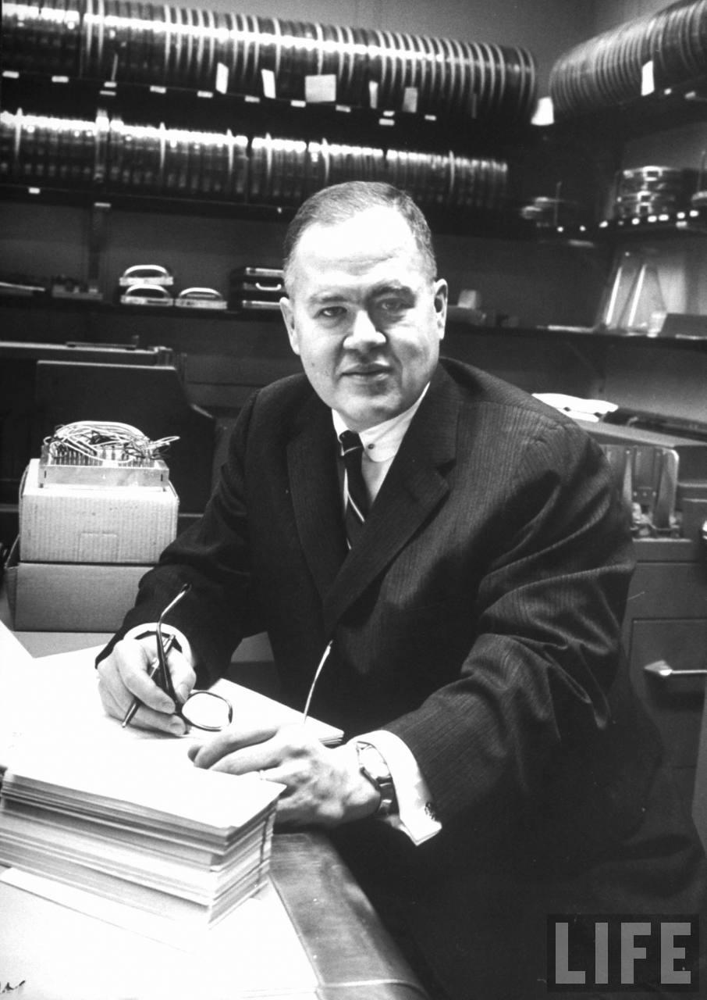

### John Tukey

"The best thing about being a statistician is that
you get to play in everyone's backyard."

### About me

I am an *applied statistician*. A sampling of projects and datasets
I have worked on include:

- cell phone telemetry
- emergency room patient flow
- finding holes in specialized medical coverage in rural US
- Canadian court case citations
- Olympic figure skating scoring
- auto insurance risk factors
- 170k documentary photographs from the 1930's
- treatment outcomes for open-angle glaucoma
- detecting radicalization from social media data
- financial warfare

# Statistics?

### Hans Rosling

Hans Rosling's 200 Countries, 200 Years, 4 Minutes:

- [https://www.youtube.com/watch?v=jbkSRLYSojo](https://www.youtube.com/watch?v=jbkSRLYSojo)

### NYTimes

Gun homicides in New Zealand are about as common as deaths from
falling from a ladder in the United States.

- [http://nyti.ms/28yRifm](http://nyti.ms/28yRifm)

### FiveThirtyEight

Steroids Probably Aren't Causing Baseball's Power Surge

- [http://53eig.ht/2aKodni](http://53eig.ht/2aKodni)

### Data Analysis

### Statistics in 209

This course is truly about the holistic process of **doing**
statistics. There will be very little mathematical content. For that,
you'll need the MATH329 (Probability) and MATH330 (Statistics)
sequence.

**So, come into this course with an open mind about
what we will be covering. I believe you will find it interesting,
fun, and incredibly useful.**

# Syllabus

